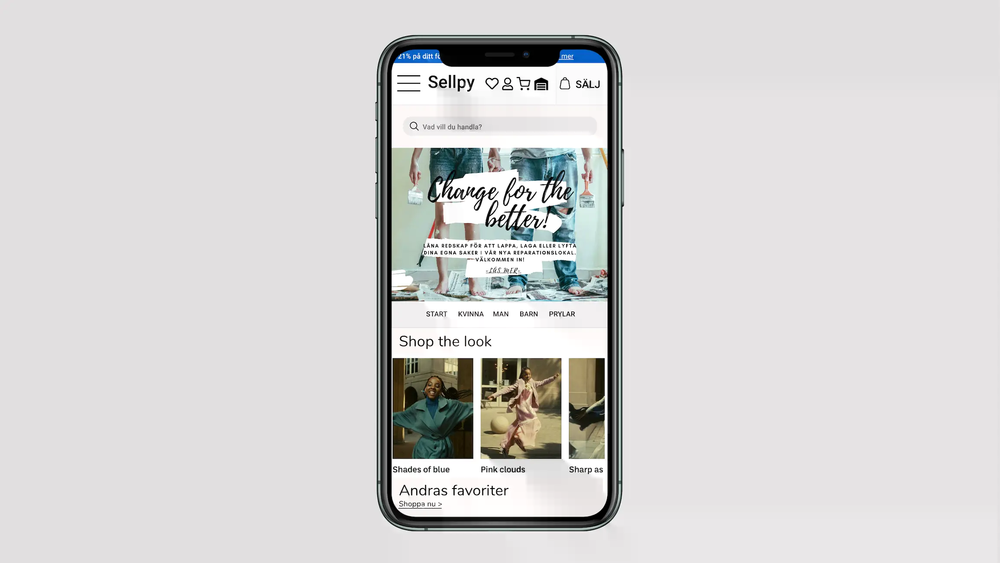

## About The Project

Ux Implementation of a Figma prototype into a usable website. All materials from the UX course (including the figma prototype) is found in the folder "UX". 

## Figma Prototype

  

  ## Website

  https://sellpy-service-hall.surge.sh/

### Built With

- [React](https://reactjs.org/)
- [Firebase](https://firebase.google.com/docs/guides)
- [styled-components](https://styled-components.com/)
- [React-router-dom](https://reactrouter.com/web/guides/quick-start)
- [Surge](https://surge.sh/)

## Owner

Emma Lilja 